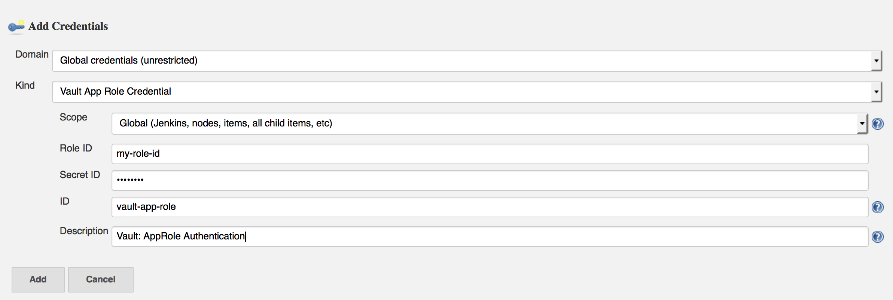
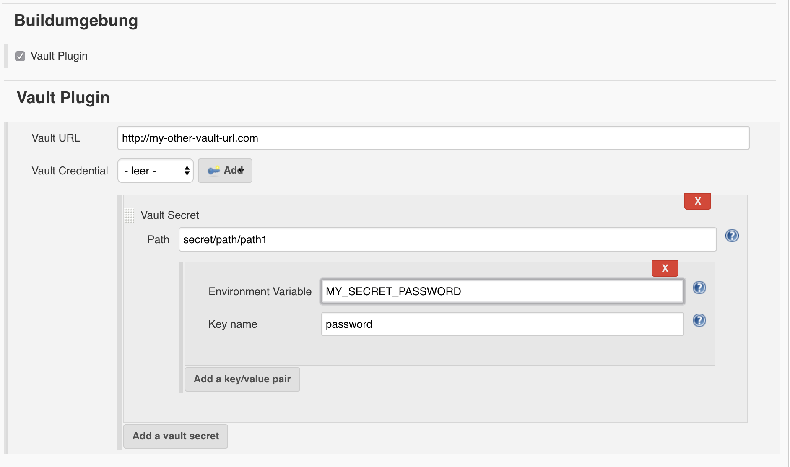

[](https://jenkins.ci.cloudbees.com/job/plugins/job/hashicorp-vault-plugin)
# Jenkins Vault Plugin

This plugin adds a build wrapper to set environment variables from a HashiCorp [Vault](https://www.vaultproject.io/) secret. Secrets are generally masked in the build log, so you can't accidentally print them.

# Vault Authentication Backends
This plugin allows authenticating against Vault using the AppRole authentication backend. Hashicorp recommends using AppRole for Servers / automated workflows (like Jenkins) and using Tokens (default mechanism, Github Token, ...) for every developer's machine.
  Furthermore, this plugin allows using a Vault Token - either configured directly in Jenkins or read from an arbitrary file on the Jenkins Machine.

### How does AppRole work?
In short: you register an approle auth backend using a self-chosen name (e.g. Jenkins). This approle is identified by a `role-id` and secured with a `secret_id`. If you have both of those values you can ask Vault for a token that can be used to access vault.
When registering the approle backend you can set a couple of different parameters:
* How long should the `secret_id` live (can be indefinite)
* how often can one use a token that is obtained via this backend
* which IP addresses can obtain a token using `role-id` and `secret-id`?
* many more

This is just a short introduction, please refer to [Hashicorp itself](https://www.vaultproject.io/docs/auth/approle.html) to get detailed information.
### What about other backends?
Hashicorp explicitly recommends the AppRole Backend for machine-to-machine authentication. Token based auth is mainly supported for backwards compatibility.
Another backend that might make much sense is the AWS EC2 backend, but we do not support it yet. Feel free to contribute!

Implementing additional authentication backends is actually quite easy:

Simply provide a class implementing `VaultTokenCredential` that contains a `Descriptor` extending `BaseStandardCredentialsDescriptor`.
The `Descriptor` needs to be annotated with `@Extension`. Your credential needs to know how to authenticate with Vault and provide an authenticated Vault session.
See [VaultAppRoleCredential.java](https://github.com/jenkinsci/hashicorp-vault-plugin/blob/master/src/main/java/com/datapipe/jenkins/vault/credentials/VaultTokenCredential.java) for an example.


# Plugin Usage
### Configuration
You can configure the plugin on three different levels:
* Global: in your global config
* [Folder](https://wiki.jenkins-ci.org/display/JENKINS/CloudBees+Folders+Plugin)-Level: on the folder your job is running in
* Job-Level: either on your freestyle project job or directly in the Jenkinsfile

The lower the level the higher its priority, meaning: if you configure a URL in your global settings, but override it in your particular job, this URL will be used for communicating with Vault.
In your configuration (may it be global, folder or job) you see the following screen:


The credential you provide determines what authentication backend will be used.
Currently, there are three different Credential Types you can use:

#### Vault App Role Credential



You enter your `role-id` and `secret-id` there. The description helps to find your credential later, the id is not mandatory (a UUID is generated by default), but it helps to set it if you want to use your credential inside the Jenkinsfile.

#### Vault Token Credential


Directly specify a token to be used when authenticating with vault.

#### Vault Token File Credential


Basically the same as the Vault Token Credential, just that the token is read from a file on your Jenkins Machine.
You can use this in combination with a script that periodically refreshes your token.

### Usage in FreeStyle Jobs
If you still use free style jobs (hint: you should consider migrating to [Jenkinsfile](https://jenkins.io/doc/book/pipeline/)), you can configure both configuration and the secrets you need on the job level.



The secrets are available as environment variables then.

### Usage via Jenkinsfile
Let the code speak for itself:
```groovy
node {
  // define the secrets and the env variables
  def secrets = [
      [$class: 'VaultSecret', path: 'secret/testing', secretValues: [
          [$class: 'VaultSecretValue', envVar: 'testing', vaultKey: 'value_one'],
          [$class: 'VaultSecretValue', envVar: 'testing_again', vaultKey: 'value_two']]],
      [$class: 'VaultSecret', path: 'secret/another_test', secretValues: [
          [$class: 'VaultSecretValue', envVar: 'another_test', vaultKey: 'value']]]
  ]

  // optional configuration, if you do not provide this the next higher configuration
  // (e.g. folder or global) will be used
  def configuration = [$class: 'VaultConfiguration',
                       vaultUrl: 'http://my-very-other-vault-url.com',
                       vaultCredentialId: 'my-vault-cred-id']

  // inside this block your credentials will be available as env variables
  wrap([$class: 'VaultBuildWrapper', configuration: configuration, vaultSecrets: secrets]) {
      sh 'echo $testing'
      sh 'echo $testing_again'
      sh 'echo $another_test'
  }
}
```
In the future we might migrate to a [BuildStep](http://javadoc.jenkins-ci.org/hudson/tasks/BuildStep.html) instead of a BuildWrapper.

# Migration Guide

### Upgrade from 1.x to 2.0
The `BuildWrapper` did not change, so no changes to your Jenkinsfile should be necessary. However, you need to reconfigure Vault in your Jenkins instance based on the instructions above. There is no way to smoothly upgrade this, because this is a major rewrite and handling of configuration completly changed.

# CHANGELOG

* **2017/04/27** - Breaking change release (AppRole auth backend, Folder ability, improved configuration, ...)
* **2017/04/10** - Feature Release - 1.4
  * Support reading Vault Token from file on disk [JENKINS-37713](issues.jenkins-ci.org/browse/JENKINS-37713)
  * Using credentials plugin for authentication token [JENKINS-38646](issues.jenkins-ci.org/browse/JENKINS-38646)
* **2017/03/03** - Feature Release - 1.3
  * Vault Plugin should mask credentials in build log [JENKINS-39383](issues.jenkins-ci.org/browse/JENKINS-39383)
* **2016/08/15** - Re-release due to failed maven release - 1.2
* **2016/08/11** - Bugfix release - 1.1
  * Refactor to allow getting multiple vault keys in a single API call [JENKINS-37151](https://issues.jenkins-ci.org/browse/JENKINS-37151)
* **2016/08/02** - Initial release - 1.0

[global_configuration]: docs/images/global_configuration.png
[job_configuration]: docs/images/job_configuration.png
